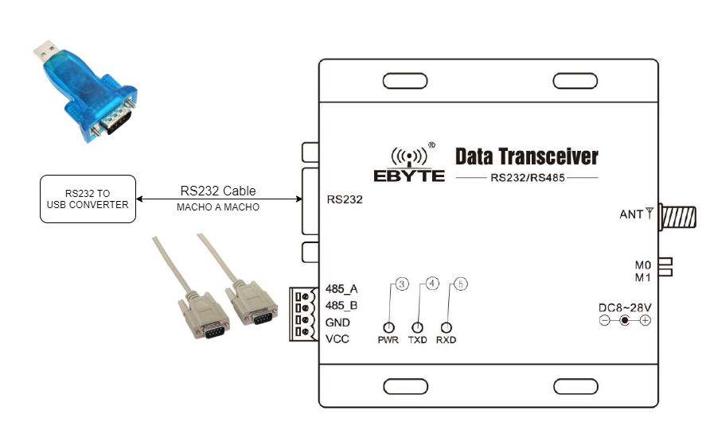
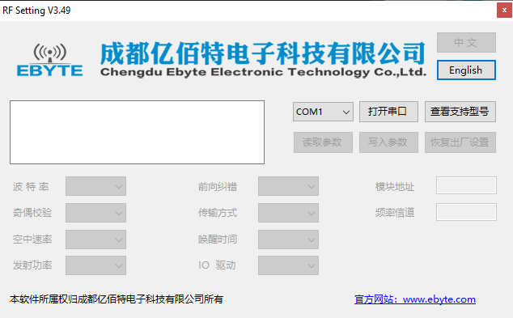
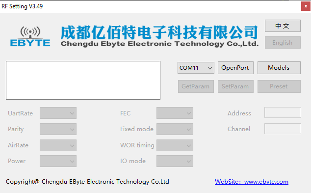
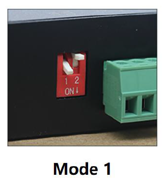
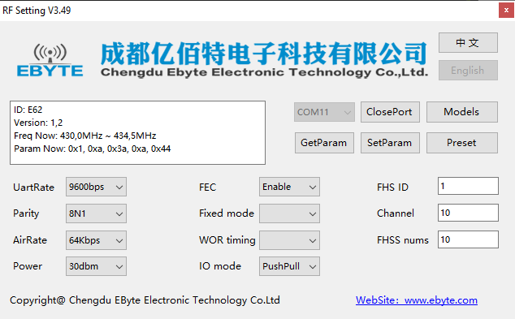
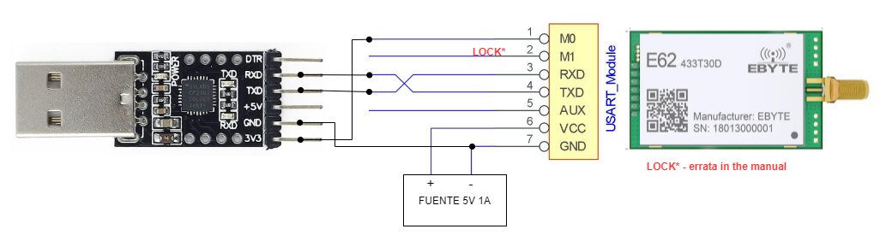

# Ebyte_E62
Este repositorio se ha creado con la intención de registrar el proceso de configuración tanto de un transductor actuando como radio base y un modulo conectable a Arduino como un módulo sensor o aplicaciones de control remoto o monitorización en tiempo real.

## Problemas encontrados
Uno de los principales problemas encontrados es que la documentación dada por el fabricante es confusa con el módulo serie, ya que hace referencia al M1 o LOCK como input o output en el mismo pin. Esto no deja claro la funcionalidad en el uso del módulo, de todas formas interemos ver como configurarlo para variar la configuración.

Este problema no afecta a l 

# Configuración 
## Estación base
Para configurar la estación base es relativamente sencillo, necesitamos:
- La propia estación DTU
- Fuente de alimentación para la DTU
- Cable RS232 macho a macho
- Convertidor de RS232 a USB (Tener el cuenta la instalación del driver, por ejemplo, en mi caso el convertidor usaba el chipset CH340, famoso por su uso en las copias de Arduino)

Tendriamos un diagrama similar, obviamente con la alimentación conectada, el diagrama trata de ser ilustrativo de los componentes necesarios para su conexión.

Una vez conectado al ordenador, abrimos el programa dado por el fabricante **RF_Setting_v3.49.exe**, lo podeis encontrar la carpeta docs del repo.

Al inicio, este programa se encuentra en chino, lo podemos cambiar facilmente al Inglés, por comodidad.

Asegurate de tener la radio en el Modo 1 para habilitar la configuración.

Para leer la configuración actual, debemos darle a **OpenPort**, y luego, **GetParam**. Y veras la siguiente configuración por defecto. Puedes realizar cambios y guardar la configuración con **SetParam**. Y ya estaría.

## Módulo 
Para el módulo a conectar remotamente, se puede usar la misma aplicación para configurarlo, solo debemos seguir el siguiente diagrama de conexiones.

El convertidor que empleo usa 3.3V para comunicarse por TTL, el módulo es tolerante a 5V, aunque no recomiendo usarlo, leer las intrucciones. Para un uso prolongado a 5V es muy posible que se queme el módulo, para una configuración, no creo, de todas formas si podeís hacerlo a 3.3V mejor.

